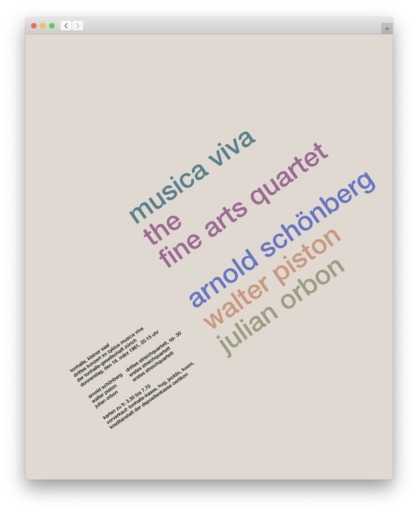

# 🇨🇭 ResponsiveMullerBrockmann
## Who is that [Josef Müller-Brockmann](https://www.google.com/search?q=Josef+M%C3%BCller-Brockmann+work&client=safari&rls=en&source=lnms&tbm=isch&sa=X&ved=2ahUKEwij7MSblPrpAhWqILkGHQVyCisQ_AUoAXoECA4QAw&biw=1792&bih=961)
Quoting [Graphéine](https://www.grapheine.com/en/history-of-graphic-design/graphic-designer-muller-brockmann-swiss-style):
> The father of Swiss graphic design  
>  
> Müller-Brockmann is probably one of the most influential graphic designers in the history of our profession. His work is always taught, studied and published. It is certainly the figurehead of Swiss graphic design (which also takes the name of international style). His work is influenced by Bauhaus and constructivism. Typography and geometry are predominant. His compositions are based on very "rigid" grids which will be his trademark. An economical and rational style.

So he basically knows a bit or two about grids (he actually wrote [a really interesting book](https://www.amazon.com/-/es/Josef-Müller-Brockmann/dp/3721201450) about them).

## About this project
I'm a big CSS grid evangelist™, but I realized I didn't have much experience exploring it in non-work related projects, so I though I might as well do!

I chose to play around with Müller's graphic design work because of it's very peculiar grids and heavy reliance on typography.

## Poster Directory
These are all the posters available to explore in this repo. More will (hopefully) be added soon. In all cases, you can see the original version by adding `/original.jpg` to the URL.

[Musica Viva (1959)](https://laurasandoval.github.io/ResponsiveMullerBrockmann/musica-viva-1959/)           |  [Musica Viva (1961)](https://laurasandoval.github.io/ResponsiveMullerBrockmann/musica-viva-1961/)
:-------------------------:|:-------------------------:
  |  

## Contributing
Feel like adding one? Sure! Just make it simple, concise, and accessible.

## Acknowledgments
This silly project (and a big part of my real job) wouldn't be possible without the inspiration and knowledge provided by:
* Jen Simmons's [Layout Land](https://www.youtube.com/channel/UC7TizprGknbDalbHplROtag)
* [Mozilla's Developer YouTube channel](https://www.youtube.com/channel/UCh5UlGiu9d6LegIeUCW4N1w)
